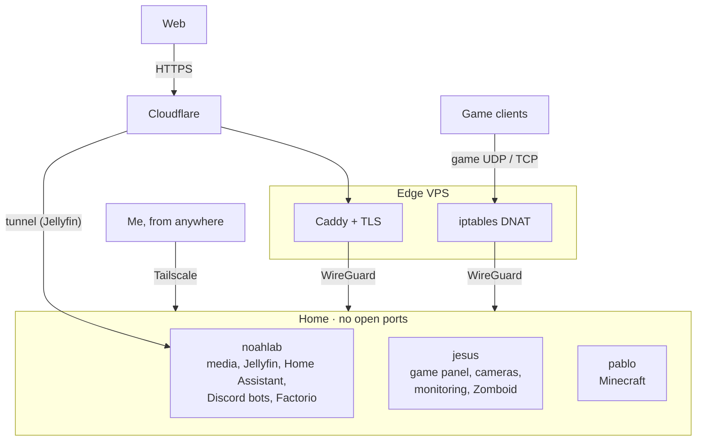

# MILKHAUS · homelab

This is everything I run at home. Three machines in my house and one small VPS, hosting
game servers for my friends, a movie site, my Discord bots, cameras, and a lot of
automation for the house. It started because I just wanted a personal stream thing and
kinda got out of hand lol.

Every compose file, config and script in here is the real one that's running right now.
The only difference is the passwords got pulled out on the way. The public side of all
this is **[milkhaus.net](https://milkhaus.net)**.

## How it's wired

My router forwards zero ports. Web traffic comes in through Caddy on the VPS or a
Cloudflare tunnel, game traffic gets DNAT'd on the VPS and rides WireGuard home, and
I get in over Tailscale. The torrent client has its own VPN that only exists inside its
container, so it can't leak onto anything else. More in
[docs/architecture.md](docs/architecture.md).

## The boxes

| | Hardware | What it does |
|---|---|---|
| **noahlab** | Ryzen 7 2700X · GTX 1660 SUPER · 32 GB · 14 TB media drive + 1 TB backup SSD | Media pipeline, Jellyfin with GPU transcoding, Home Assistant, the Discord bots, Factorio |
| **jesus** | Ryzen 9 3900X · GTX 970 · 32 GB | Pterodactyl panel, Frigate on nine cameras, Prometheus + Grafana, Zomboid |
| **pablo** | Ryzen 5 5600X · RX 560 · 16 GB | Minecraft (Java + Bedrock) |
| **VPS** | 1 vCPU | Caddy, game port forwarding, the static sites |

All of it is Docker on Ubuntu.

## What's in here

| Folder | What it is |
|---|---|
| [`services/media`](services/media/) | qBittorrent behind gluetun, Sonarr/Radarr/Prowlarr, Jellyseerr, Bazarr, Recyclarr, autobrr, cross-seed, plus a couple of small Python scripts that handle seeding rules and dupes |
| [`services/jellyfin`](services/jellyfin/) | Jellyfin pinned to a version that works, NVENC tuning, and 84 free live TV channels with a guide |
| [`services/frigate`](services/frigate/) | Nine cameras, object detection on the GPU, a week of recording, PTZ controls in Home Assistant |
| [`services/home-assistant`](services/home-assistant/) | Presence-based HVAC and lights, doorbell snapshots, chore reminders, Matter bridge, Mosquitto |
| [`services/monitoring`](services/monitoring/) | Prometheus + Grafana. The dashboards are built from Python so changes show up as a diff |
| [`services/pterodactyl`](services/pterodactyl/) | The game panel, plus the stuff that keeps Factorio updated and the docker network from disappearing |
| [`services/pzstats`](services/pzstats/) | The live stats page at [pz.milkhaus.net](https://pz.milkhaus.net), built from the server logs |
| [`services/igembed`](services/igembed/) · [`services/xembed`](services/xembed/) | Instagram and X link fixers so posts actually preview in Discord |
| [`services/portmap`](services/portmap/) | A little site that maps every port and box in the lab |
| [`services/donetick`](services/donetick/) | Chore chart that pushes to phones through Home Assistant |
| [`services/filebrowser`](services/filebrowser/) | Web file manager for the media drive |
| [`services/xmrig`](services/xmrig/) | Idle-time miner with a thermal watchdog so it backs off when it gets hot |
| [`virtual-desktop/`](virtual-desktop/) | A headless desktop on the GPU I can stream to my phone with Moonlight, with a browser that stays logged in |
| [`edge/`](edge/) | The VPS side: Caddy and the game port forwarding |
| [`ops/`](ops/) | Nightly backups to a second drive, and alerts that hit my phone when something's off |
| [`tools/`](tools/) | The scripts that keep this repo safe to be public |

## Stuff I learned the hard way

Nothing works how you think it does, I promise. Most of what's in here exists because
something broke first:

- a `docker system prune` deleted a game server's network, so now a timer puts it back
- the VPN health check restarted the tunnel 579 times in one night
- Jellyfin generating trickplay images starved the game servers. Pinning cores fixed it:
  frame overruns went from 22 to 2 per five minutes and load went from 20.7 to 4.9
- six idle Chromiums plus everything else ran the box out of memory and the OOM killer
  took out three browsers at once
- the nightly backup was quietly skipping the files that actually mattered

Full write-ups are in [docs/incidents.md](docs/incidents.md).

## Keeping my passwords out of this

The live configs have real credentials in them, so nothing gets copied here by hand:

1. [`tools/sync-from-live.sh`](tools/sync-from-live.sh) copies the live files over and
   swaps secrets for `${VAR}` placeholders, with `.env.example` files next to them.
2. [`tools/verify-no-leaks.sh`](tools/verify-no-leaks.sh) checks the result two ways. One
   pass looks for anything shaped like a credential. The other pulls my actual secrets
   from the live machines and makes sure none of them show up anywhere in the repo. If
   either one finds something, the sync fails.
3. CI runs the pattern check again plus [gitleaks](https://github.com/gitleaks/gitleaks)
   on every push, validates every compose file, and runs the scripts' tests.

## Related

- **[milkhaus.net](https://milkhaus.net)** has everything that's running and how to get in.
- **[Milkcat Nexus](https://discord.gg/b9fhFHp8FJ)** is the Discord for help, whitelists
  and media invites.
- **Teto** is my Discord bot. It's private, but it's on the site.

## License

[MIT](LICENSE). Take whatever you want. If it saves you a 3am debugging session, that's
the whole point.
