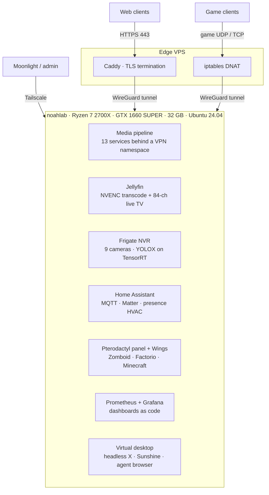

# MILKHAUS · homelab

A one-person homelab that behaves like a small platform. Everything runs on a single
machine: a fully automated media pipeline, dedicated game servers behind a management
panel, a nine-camera AI NVR, whole-house automation, Prometheus/Grafana observability,
nightly off-disk backups — and a headless virtual desktop streamed to a phone, built so
both a human and AI agents can drive a real browser on the box.

This repo is the **live configuration**, exported and sanitized by
[`tools/sync-from-live.sh`](tools/): every compose file, config, script, and systemd unit
here is what actually runs, with credentials templated out and a
[two-net leak verifier](tools/verify-no-leaks.sh) + CI secret scanning standing between
the lab and this page. The public face is **[milkhaus.net](https://milkhaus.net)**.

## Architecture

Three tunnels coexist and never mix: the **edge WireGuard** carries public traffic home,
**gluetun's WireGuard** exists only inside the torrent container's network namespace, and
**Tailscale** is the admin plane. Nothing on the home network is directly exposed —
detail in [docs/architecture.md](docs/architecture.md).

## Hardware

| | |
|---|---|
| CPU | AMD Ryzen 7 2700X (8c/16t) — cores 12–15 pinned to game servers |
| GPU | NVIDIA GTX 1660 SUPER 6 GB — NVENC/NVDEC transcode, TensorRT detection, headless X |
| RAM | 32 GB |
| Storage | 1 TB NVMe (system) · 14 TB HDD (media pool, hardlink-friendly single fs) · 1 TB SSD (dedicated backup mirror) |
| OS | Ubuntu 24.04 LTS, headless — no monitor has ever been attached |

## What runs here

| Stack | Role |
|---|---|
| [`services/media`](services/media/) | Acquisition pipeline: qBittorrent inside a gluetun VPN namespace, Sonarr/Radarr/Prowlarr, Jellyseerr requests, Bazarr subtitles, Recyclarr TRaSH sync, autobrr race automation, cross-seed, unpackerr, cleanuparr + two custom policy engines |
| [`services/jellyfin`](services/jellyfin/) | Streaming: pinned-version Jellyfin, NVENC/NVDEC tuning, plugin stack, curated 84-channel free live TV with EPG |
| [`services/frigate`](services/frigate/) | NVR: 9 cameras, GPU object detection, 7-day continuous recording, PTZ control surfaced into Home Assistant |
| [`services/home-assistant`](services/home-assistant/) | Automation: presence-driven HVAC with self-healing pollers, irrigation with a failsafe, doorbell capture, chore notifications, Matter bridge, Mosquitto |
| [`services/monitoring`](services/monitoring/) | Prometheus scraping 8 target groups + Grafana with both dashboards built from Python (versioned, reproducible) |
| [`services/pterodactyl`](services/pterodactyl/) | Game hosting: panel + native Wings, Project Zomboid / Factorio / Minecraft, self-healing docker network, unattended Factorio updates |
| [`services/pzstats`](services/pzstats/) | Public live stats page for the Zomboid server, generated from server logs + A2S queries |
| [`services/donetick`](services/donetick/) | Chore chart with webhook → Home Assistant → phone push relay |
| [`services/filebrowser`](services/filebrowser/) | Web file manager over the media pool |
| [`services/xmrig`](services/xmrig/) | Idle-time CPU miner wrapped in a thermal watchdog |
| [`virtual-desktop/`](virtual-desktop/) | Headless GPU desktop streamed via Sunshine/Moonlight, persistent agent-drivable browser, evdev→XTEST input bridge, on-demand "war room" desktops |
| [`edge/`](edge/) | The VPS side: Caddy vhosts and the game-traffic DNAT path |
| [`ops/`](ops/) | Nightly backups, hourly health alerts to a phone, traffic dashboards |
| [`tools/`](tools/) | The publishing pipeline that keeps this repo safe to be public |

## The interesting parts

- **Incident-driven design.** Most of the sharp edges here were cut by a real outage
  first: a `docker system prune` that deleted a game network (now self-healed by a
  watchdog timer), a VPN health-check loop that restarted the tunnel 579 times in one
  night, a torrent queue policy that silently generated tracker hit-and-runs, an OOM
  kill that took three browsers down at once. Write-ups: [docs/incidents.md](docs/incidents.md).
- **Policy as small programs.** Seeding rules, duplicate cleanup, and race reclamation
  are ~150-line Python scripts with embedded self-tests, not settings scattered across
  UIs: [`race-reaper.py`](services/media/scripts/race-reaper.py),
  [`media-dedup.py`](services/media/scripts/media-dedup.py),
  [`livetv-curate.py`](services/jellyfin/scripts/livetv-curate.py).
- **Dashboards as code.** Both Grafana home dashboards are generated by Python builders
  and POSTed to the API — the diff of a dashboard change is a code review, not a
  screenshot: [`services/monitoring/dashboards/`](services/monitoring/dashboards/).
- **An agent-operable machine.** The virtual desktop exposes a persistent, logged-in
  Chromium over localhost CDP; AI agents drive it through the same instance a human
  streams from a phone. A needs-attention convention (`vd-flag`) pushes to the phone
  when an agent hits a login wall: [`virtual-desktop/`](virtual-desktop/).
- **Measured, not vibed.** CPU pinning and codec tuning were done against numbers —
  game-server frame overruns went from 22 to 2 per five minutes, system load from 20.7
  to 4.9 — with the method documented: [docs/incidents.md](docs/incidents.md#3-jellyfin-trickplay-starves-the-game-servers).

## How this repo stays publishable

Live configs contain real credentials; this repo must not. The export pipeline:

1. [`tools/sync-from-live.sh`](tools/sync-from-live.sh) copies every published file from
   the live tree and applies **pattern-based** redaction (never literal secrets) —
   inline values become `${VAR}` / `{FRIGATE_*}` templates with `.env.example` files.
2. [`tools/verify-no-leaks.sh`](tools/verify-no-leaks.sh) then proves the tree clean two
   ways: a credential-shape pattern sweep, and a value sweep that harvests the *actual*
   secrets from the live stores and asserts none appear in any published file. A failed
   verify fails the sync.
3. CI re-runs the pattern sweep plus [gitleaks](https://github.com/gitleaks/gitleaks) on
   every push, validates every compose file, and runs the scripts' self-tests.

## Related

- **[milkhaus.net](https://milkhaus.net)** — the lab's front door and portfolio.
- **Teto's Casino** — a Discord resident with long-term memory and a six-game casino
  (private; described on the site).
- **Audible** — an ESPN fantasy-football assistant with confidence-scored automation
  (private; its draft-day browser infrastructure is the [`virtual-desktop/`](virtual-desktop/) layer).

## License

[MIT](LICENSE) — configs and scripts are free to steal; the point of publishing a
homelab is that someone else gets to skip a 3 a.m. debugging session.
