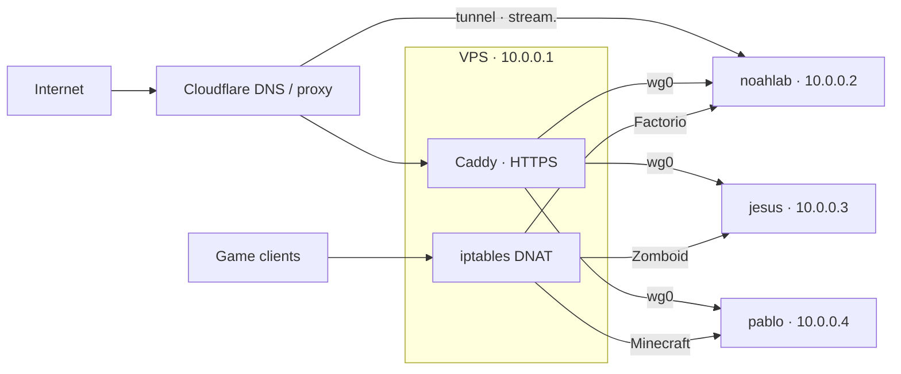

# Architecture

Three machines at home and one VPS. The home boxes are **noahlab**, **jesus** and
**pablo**. None of them has a port open to the internet. Everything public comes in
through the VPS or a Cloudflare tunnel.

## The nodes

| | Hardware | WireGuard | Runs |
|---|---|---|---|
| **noahlab** | Ryzen 7 2700X (16 threads) · GTX 1660 SUPER · 32 GB · 1 TB NVMe, 14 TB HDD, 1 TB backup SSD | `10.0.0.2` | Media pipeline, Jellyfin, Home Assistant + Mosquitto + Matter, Pi-hole, Discord bots + their dashboards, link fixers, pzstats/mcstats, virtual desktop, Factorio |
| **jesus** | Ryzen 9 3900X (24 threads) · GTX 970 · 32 GB · 1 TB | `10.0.0.3` | Pterodactyl panel, Frigate, Prometheus + Grafana, Audible, Project Zomboid |
| **pablo** | Ryzen 5 5600X (12 threads) · RX 560 · 16 GB · 240 GB | `10.0.0.4` | Minecraft (Java + Bedrock) |
| **VPS** | 1 vCPU | `10.0.0.1` | Caddy, game port forwarding, the static sites |

All three home boxes are Ubuntu 24.04 running Docker, and all three are Pterodactyl
nodes (Wings runs natively on each). noahlab is the one with the big drive, so anything
that needs storage ends up on it, and the other two borrow it over NFS (more below).

## How traffic gets in

There are four ways in, and they don't mix:

| Path | Carries |
|---|---|
| **Cloudflare tunnel** (`cloudflared` on noahlab) | Jellyfin only. It used to go through the VPS, but WireGuard decrypt on one vCPU topped out around 200 Mbps. The tunnel does ~270 on a single stream and keeps my home IP out of DNS. |
| **Edge WireGuard** (`wg0`, VPS ↔ each node) | Every other public site, plus game traffic |
| **gluetun WireGuard** | Only exists inside the torrent container's network namespace. Torrent traffic and the VPN provider's forwarded port. |
| **Tailscale** | How I get in. SSH, web UIs, Moonlight, monitoring. Admin stuff doesn't listen anywhere else. |

### Websites

HTTPS ends at Caddy on the VPS ([`edge/Caddyfile`](../edge/Caddyfile)), which proxies
over WireGuard to whichever node has the service:

| Site | Goes to |
|---|---|
| `request.` · `join.` · `files.` | noahlab: Jellyseerr, jfa-go invites, Filebrowser |
| `pz.` · `mc.` | noahlab: the Zomboid and Minecraft status pages |
| `ig.` · `x.` | noahlab: the Instagram and X link fixers |
| `stats.` (and `stats./manage`) | noahlab: Teto's server stats dashboard and manager panel |
| `panel.` | jesus: Pterodactyl panel |
| `node1.` · `jesus.` · `pablo.` | Wings API on each node, port 8090. This is how the panel talks to them. |
| `milkhaus.net` and the other static sites | Served straight off the VPS |
| `stream.` | Not on the VPS at all. Cloudflare tunnel to noahlab. |

### Game servers

Game traffic never touches Caddy. It's plain `iptables` DNAT on the VPS, saved with
`netfilter-persistent`:

| Game | Ports | Node |
|---|---|---|
| Factorio | UDP 34197 | noahlab |
| Project Zomboid | UDP 16261, 16262 | jesus |
| Minecraft Java | TCP 25565 | pablo |
| Minecraft Bedrock (Geyser) | UDP 19132 | pablo |

Two things I learned the hard way (see [incidents](incidents.md)):

1. **Opening a game port takes three changes, not two.** The VPS provider has its own
   cloud firewall in front of the box, and packets dropped there never even show up in
   `tcpdump`. Provider firewall, then `ufw`, then the DNAT rule. Test from a network
   that isn't yours.
2. **Game subdomains have to be grey cloud (DNS only).** Cloudflare's proxy only does
   HTTP(S), so an orange-cloud record just eats game UDP. Same reason SFTP on port
   2022 doesn't work from outside on any node; the panel's file manager is fine.

Also, the DNAT rules carry `-i enp1s0`. Deleting one without it silently fails and the
old rule keeps winning.

## Adding a node

A node needs three things before the panel can see it. Wings running isn't enough.

1. A Cloudflare record `<node>.milkhaus.net` pointing at the VPS (proxied). Do this
   **first**, or Caddy's certificate request fails and you get a 525 until the next reload.
2. A Caddy block for it proxying to `10.0.0.x:8090`.
3. A WireGuard peer on the VPS: `wg set wg0 peer <pubkey> allowed-ips 10.0.0.x/32`, then
   `wg-quick save wg0`.

Watch out for different `pterodactyl` user IDs across boxes (pablo's is different from
the other two), so `chown` after copying a server volume over. And don't copy CPU
pinning from a 24-thread box onto a 12-thread one; the server just won't start.

## Who shares what

| What | From → to | Why |
|---|---|---|
| Frigate recordings | noahlab `/mnt/media/frigate` → jesus (NFS) | jesus has the cameras' CPU, noahlab has the space |
| Zomboid server files | jesus → noahlab (NFS, read-only) | pzstats on noahlab reads the server logs |
| Minecraft server files | pablo → noahlab (NFS, read-write) | mcstats reads them, and the whitelist worker writes `whitelist.json` |

The game volumes get mounted on noahlab at the exact same path they have on their own
node, so the stats scripts didn't have to change.

## Exposure

| Ring | Examples | Reachable from |
|---|---|---|
| Public | Jellyfin, Jellyseerr, panel, invites, files, status pages, link fixers, stats | Internet, through the VPS or the tunnel. Media accounts are invite-only. |
| Game | Zomboid, Factorio, Minecraft (whitelisted) | Internet, through VPS DNAT |
| Admin | Grafana, Prometheus, the *arr apps, qBittorrent, Frigate, Home Assistant, Sunshine | Tailscale or LAN only |
| Localhost only | Chromium CDP ports, Wings token API, the bots' manage APIs | The box itself. CDP gives full control of a logged-in browser, so it never leaves the machine. |

## Keeping games smooth

The rule is that games get their own cores and nothing else is allowed on them.

| Node | Game cores | Everything else |
|---|---|---|
| noahlab | Factorio on threads 10–15 | Jellyfin, the *arr apps, qBittorrent, link fixers, stats pages pinned to 0–9 |
| jesus | Zomboid on threads 10–15 | Frigate pinned to 0–9 and 16–21 |
| pablo | Minecraft, unpinned | It's the only thing on the box |

Game pinning gets applied by Wings from the panel. You need both halves. Pinning games
to a few cores while everything else still floods them is *worse* than not pinning at
all. The numbers are in [incidents #3](incidents.md#3-jellyfin-trickplay-starves-the-game-servers).

## Storage

| Device | Where | What |
|---|---|---|
| 1 TB NVMe | noahlab `/` | OS, containers, app state |
| 14 TB HDD | noahlab `/mnt/media` | One filesystem for downloads *and* the library, so imports are hardlinks and seeding doesn't take extra space. Don't split it up per app. Frigate recordings live here too. |
| 1 TB SSD | noahlab `/mnt/backup` | Backup mirror on a separate drive. Mounted `nofail`, and a missing mirror sends an alert instead of skipping quietly. |

jesus and pablo only have their system drives.

## Keeping it alive

- **Watchdogs.** Every home box has a hardware watchdog (`sp5100_tco`, systemd
  `RuntimeWatchdogSec=30s`) that resets a frozen kernel, and reboots itself 10 seconds
  after a kernel panic.
- **Wake-on-LAN** is on for all three, so any box on the LAN can wake the others.
- **`rescue <box>`** gets a shell on any machine by trying Tailscale, then LAN, then
  WireGuard, then relaying through whatever box it can reach.
- **`fleet-check`** runs every 10 minutes from noahlab, jesus and the VPS, staggered.
  Two misses in a row and I get a Telegram message, then one more when it comes back.
- **Backups** run nightly at 4:30 on noahlab and mirror to the backup SSD
  ([`ops/`](../ops/)). An hourly check pushes to my phone if a backup is old, a disk is
  filling up, or a container died.

## DNS

`/etc/resolv.conf` stays the `systemd-resolved` stub symlink. Tailscale MagicDNS
injects `100.100.100.100` through resolved. A hand-pinned `chattr +i` resolv.conf
broke MagicDNS once, see [incidents #7](incidents.md#7-the-immutable-resolvconf). On
the LAN, Pi-hole on noahlab hands out DNS for every device through the router.
