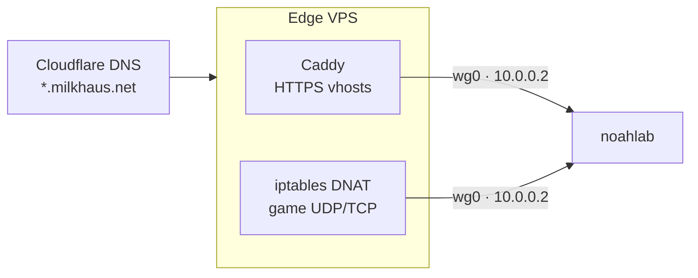

# Architecture

One physical machine (`noahlab`, `192.168.1.10`) serves everything. What makes it
usable from the outside is the network path in front of it.

## Three tunnels, never mixed

| Tunnel | Scope | Carries |
|---|---|---|
| **Edge WireGuard** (`wg0`, `10.0.0.2 ↔ 10.0.0.1`) | host interface | All public traffic: HTTPS vhosts and game-server UDP/TCP relayed from the VPS |
| **gluetun WireGuard** | exists *only inside* the torrent container's network namespace | Torrent traffic + the provider's forwarded port (48592) |
| **Tailscale** | host interface, mesh | The admin plane: SSH, web UIs, Moonlight streaming, monitoring — nothing admin listens anywhere else |

The home router forwards **zero ports**. Every inbound path is either the VPS tunnel,
the torrent VPN's provider-side forwarded port, or the Tailscale mesh.

## The edge path

**HTTP(S)** terminates at Caddy on the VPS ([`edge/Caddyfile`](../edge/Caddyfile)) and
reverse-proxies over the tunnel:

| vhost | Backend on `10.0.0.2` |
|---|---|
| `stream.milkhaus.net` | Jellyfin `:8096` |
| `request.milkhaus.net` | Jellyseerr `:5055` |
| `join.milkhaus.net` | jfa-go invites `:8056` |
| `panel.milkhaus.net` | Pterodactyl `:8081` |
| `node1.milkhaus.net` | Wings API `:8090` |
| `files.milkhaus.net` | Filebrowser `:8087` |
| `milkhaus.net` | Static splash page, served at the edge |

**Game traffic never touches Caddy** — a proxy would add latency and can't speak the
protocols anyway. It's plain `iptables` DNAT on the VPS, persisted via
`netfilter-persistent`: UDP 16261/16262 (Project Zomboid), UDP 34197 (Factorio),
TCP 25565 (Minecraft — the only TCP game here).

Two rules learned the hard way (see [incidents](incidents.md)):

1. **Opening a game port takes three changes, not two.** The hosting provider's
   cloud firewall filters *upstream of the instance* — packets dropped there never
   even appear in `tcpdump` on the VPS NIC. Provider firewall → `ufw` → DNAT, in that
   order, then verify with `tcpdump -i <nic> udp port 
` from an unrelated network.
2. **Game subdomains must be DNS-only (grey cloud).** Cloudflare's proxy carries
   HTTP(S) only; an orange-cloud record silently eats game UDP.

Odd but true: Zomboid answers Steam A2S queries on its game port (16261), not the
second port, so the [stats page](../services/pzstats/) queries there.

## Exposure model

| Ring | Examples | Reachable from |
|---|---|---|
| Public | Jellyfin, Jellyseerr, panel, invites, files, splash, PZ stats | Internet via VPS (TLS at edge, invite-only accounts) |
| Game UDP/TCP | Zomboid, Factorio, Minecraft (whitelisted) | Internet via VPS DNAT |
| Admin | Grafana, *arr suite, qBittorrent WebUI, Frigate, HA, Sunshine | Tailscale / LAN only |
| Localhost-only | Chromium CDP endpoints (9222/9311/9312), Wings token API | The box itself — CDP grants full control of the logged-in browser and is never exposed |

## Compute isolation

The CPU is split so a media transcode can never starve a game tick:

- Game containers get `--cpuset-cpus 12-15` (applied by Wings from the panel DB).
- Every heavy media service is pinned to `cpuset: "0-9"`/`0-11` in compose.

Both halves are required — pinning games to four cores that everything else still
floods is *worse* than no pinning. Measured effect in
[incidents #3](incidents.md#3-jellyfin-trickplay-starves-the-game-servers).

## Storage

| Device | Mount | Purpose |
|---|---|---|
| 1 TB NVMe | `/` | OS, containers, app state |
| 14 TB HDD | `/mnt/media` | One filesystem for downloads *and* libraries — imports are hardlinks, seeding costs zero extra bytes. Never split this mount per-app. |
| 1 TB SATA SSD | `/mnt/backup` | Dedicated backup mirror on separate hardware (`nofail`; an unmounted mirror alerts rather than silently skipping) |

## DNS

`/etc/resolv.conf` stays the `systemd-resolved` stub symlink; Tailscale MagicDNS
injects `100.100.100.100` through resolved. A hand-pinned, `chattr +i` resolv.conf
once broke MagicDNS on this box — [incidents #7](incidents.md#7-the-immutable-resolvconf).
