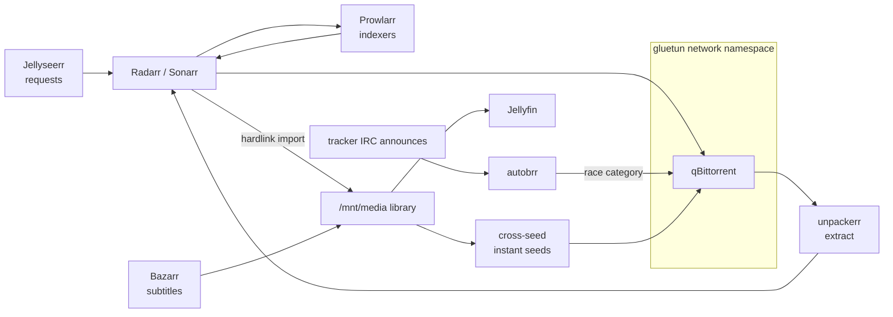

# Media pipeline

Thirteen services in one compose project: fully automated acquisition from request to
library, with the torrent client sealed inside a VPN network namespace and the seeding
policy enforced by code.

## VPN isolation

qBittorrent runs with `network_mode: service:gluetun` — it has no network identity of
its own. If the tunnel is down, torrents are off; there is no leak path to fail open.
`depends_on: {gluetun: {restart: true}}` recreates the client whenever the tunnel
container is recreated, and other services reach the WebUI at hostname `gluetun`.

The provider-forwarded port (48592) is mirrored in gluetun's firewall input rules and
qBittorrent's listen port, and is verified externally reachable on the VPN exit IP.

gluetun's health check uses IP literals and plain DNS on purpose — its default
DoT-resolved health targets once turned a flaky resolver into 579 tunnel restarts in a
night ([incident #2](../../docs/incidents.md#2-the-vpn-restart-loop-579-restarts-in-one-night)).

## Quality policy (Recyclarr / TRaSH)

[`recyclarr/recyclarr.yml`](recyclarr/recyclarr.yml) syncs TRaSH custom formats daily
and owns the **"1080p Efficient"** profile in both apps:

- WEB 1080p cutoff with 720p fallback, upgrades allowed.
- **x265 (HD) scored +200** — deliberately inverting TRaSH's default −10000. Space-
  efficient 1080p is the goal on a 14 TB pool; the standard "x265 ruins remuxes"
  argument optimizes for a different library.
- A 60-minute torrent delay profile smooths out bad early releases, **bypassed when
  the custom-format score is ≥200** — well-formatted x265 releases grab instantly.
- Anime keeps separate 720p-first, dub-boosted profiles that Recyclarr does not manage.

## Seeding policy

| Class | Rule | Enforced by |
|---|---|---|
| Public trackers | delete at ratio 1.0 or 24 h | cleanuparr |
| Private tracker | seed indefinitely | cleanuparr exemption |
| Races (`race` category) | per-torrent ratio 10 / 14 d caps, ≤15 grabs/week, ≤30 GB | autobrr filter + qBittorrent |
| Race reclamation | delete only when past the tracker's 10-day hit-and-run window **and** dead/stopped/aged out; 500 GiB category disk ceiling that never violates the window | [`scripts/race-reaper.py`](scripts/race-reaper.py) (hourly, self-tested) |

Queueing matches what the tracker actually limits: **3 active downloads** (the
tracker grants exactly 3 slots — never raise it), seeds and announces unlimited. The
old 75-slot cap parked torrents in `queuedUP`, where they stop announcing — which the
tracker records as hit-and-runs
([incident #6](../../docs/incidents.md#6-queue-policy-quietly-generates-tracker-hit-and-runs)).

**autobrr** listens to the tracker's IRC announce channel and races matching releases
into the `race` category with aggressive reannounce (7 s × 50). **cross-seed** (daemon
mode) does the opposite of racing: it finds tracker matches for data already on disk
and injects them as instant seeds, hardlinked, with the `race` category excluded.

## Policy engines

Two standalone Python scripts (both dry-run by default, `--apply` in cron,
`--selftest` runs an embedded policy test suite):

- [`scripts/race-reaper.py`](scripts/race-reaper.py) — the seeding-policy half that a
  GUI can't express: hit-and-run-safe reclamation with a disk ceiling.
- [`scripts/media-dedup.py`](scripts/media-dedup.py) — keeps exactly one video per
  movie/episode. The *arr-tracked file always wins (nothing re-downloads), files
  hardlinked into `downloads/` are never touched (they're seeding), and nothing is
  hard-deleted — duplicates move to a dated quarantine with a JSONL restore manifest,
  purged after 14 days.

## Storage contract

`/mnt/media` is one filesystem mounted identically (as `/media`) in qBittorrent,
Radarr, Sonarr, unpackerr, and Jellyfin — imports are hardlinks, so a seeding copy
costs zero extra bytes. Never split this into per-app mounts.

## Operating notes

- Validate config changes with `docker compose config -q`; apply with `up -d`.
  These are long-uptime services — batch changes, recreate deliberately.
- `docker image prune -a` is unsafe box-wide: several images are local builds with no
  registry to re-pull. Plain `image prune` + `builder prune` only.
- Secrets live in `.env` (mode 600) — see [`.env.example`](.env.example). API keys
  for Recyclarr go in `recyclarr/secrets.yml`
  ([example](recyclarr/secrets.yml.example)).
- qBittorrent's WebUI requires auth except from the Tailscale range; Sonarr, Radarr,
  cleanuparr, and autobrr store that credential — rotate all five together.
