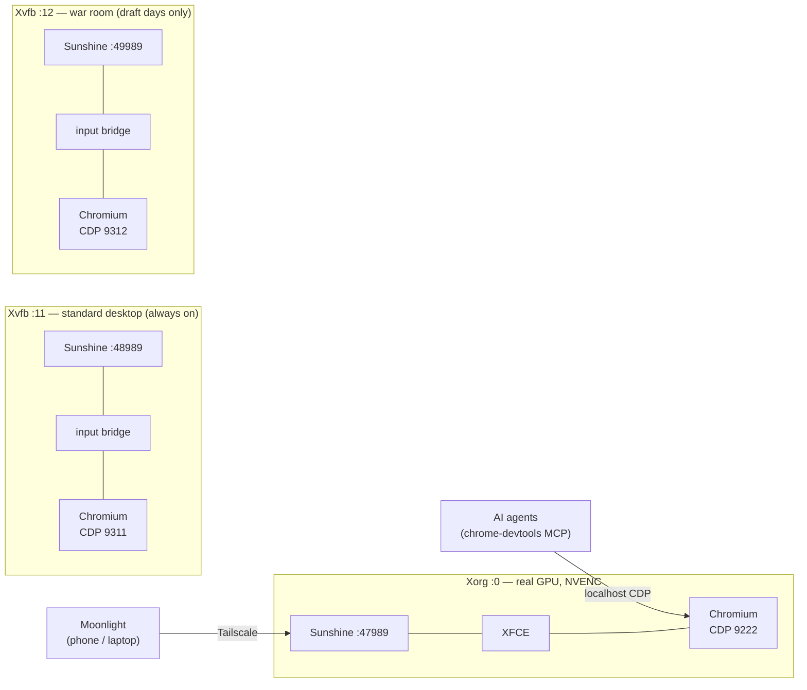

# Virtual desktop

A headless server with a real desktop problem: automation that logs into real websites
eventually hits a wall — login challenges, 2FA, captchas — that headless browsers make
*worse*. The fix is a permanent X session on the GPU of a monitor-less machine,
streamed to a phone with Sunshine → Moonlight over Tailscale, running a persistent
logged-in Chromium that **AI agents and a human drive through the same instance**: the
human handles login walls from anywhere; agents do the routine work over localhost CDP.

Built originally as draft-day infrastructure for a fantasy-football assistant — the
one workload here that cannot be redone if it breaks.

## Boot chain (no display manager)

`getty@tty1` autologin ([override](systemd/getty-autologin-override.conf)) → a
[`~/.profile`](../virtual-desktop/) hook `exec startx` on tty1 → [`xinitrc`](xinitrc)
→ minimal XFCE + the [Sunshine user unit](systemd/sunshine.service). The whole chain
is exercised safely with `systemctl restart getty@tty1` — no reboot needed.

Load-bearing details, each learned the hard way:

- The startx hook lives in `.profile`. Creating a `.bash_profile` would silently
  shadow it (bash reads only the first of the two) and drop the PATH setup with it.
- [`xorg.conf`](xorg.conf) forces the NVIDIA driver to treat a disconnected DP
  connector as attached (`ConnectedMonitor` + `ModeValidation` overrides) — this box
  has never had a monitor.
- Resolution switching must use `xrandr -s <WxH>`; `xrandr --output DP-0 --mode`
  hits a driver `BadMatch` when shrinking. Sunshine app entries do prep/undo switching
  for a 1080p stream.
- `xserver-xorg-input-libinput` must stay installed: the minimal package set ships
  **no X input driver**, which presents as a perfect video stream that ignores every
  keystroke ([incident #5](../docs/incidents.md#5-the-video-only-stream-missing-input-driver)).

## The agent browser (`bin/vd-browser`)

One persistent, logged-in Chromium on `:0` with CDP at `127.0.0.1:9222`:

- **Profile lives at a non-hidden path** — snap confinement can't read dot-dirs.
- **Profile is non-default** — Chromium ≥136 ignores `--remote-debugging-port` on the
  default profile as a credential-theft mitigation.
- **Idempotent by port probe**, not pgrep (cmdline matching false-positives on shells
  quoting the path).
- Launched in a `snap.chromium.*` systemd scope: snap refuses plain launches from
  ssh-session cgroups.
- Extensions (userscript manager, cookie tools) are force-installed by a managed
  Chromium policy so every profile — including fresh war-room clones — has them.

**CDP is localhost-only by design and must stay that way**: the debug port grants full
control of every account the profile is logged into. Agents on the box attach via a
chrome-devtools MCP server pointed at the port; nothing off-box can.

## Extra desktops without extra GPUs

League desktops run on **Xvfb** — but Xvfb has no input stack, and the real `:0` Xorg
hotplugs every input device on the box, so Sunshine's virtual devices for a league
desktop would type into the *physical* desktop instead: video-only streams plus an
input leak.

[`bin/vd-input-bridge`](bin/vd-input-bridge) closes that hole. It wraps each extra
Sunshine instance, claims the keyboard/mouse/touch trio that instance creates at
startup (ownership is deterministic: the devices that appear right after our child
starts are ours), takes an **exclusive kernel grab** — which is what stops `:0` from
seeing the events — and replays everything into the target display via XTEST.
Claiming stops after a startup window on purpose: devices that appear later belong to
someone else's session.

[`bin/vd-pair-sync`](bin/vd-pair-sync) makes pairing painless: Sunshine's security
model is a per-instance client-certificate trust list, so the script copies devices
already paired with the primary desktop into every extra instance (each keeps its own
`uniqueid` so Moonlight lists them separately). Pair once, stream anywhere, no PINs.

## Two desktops, not six

The first design gave each fantasy league its own desktop. Six idle Chromiums plus
the container stack OOM-killed three browsers at once
([incident #4](../docs/incidents.md#4-six-idle-chromiums-invoke-the-oom-killer)).
The surviving shape, in [`bin/vd-desktop`](bin/vd-desktop):

- **standard** (`:11`) — always up; routine work for every league.
- **war room** (`:12`) — dormant; exists only around a real draft, because ESPN scopes
  a draft room per connection and a draft cannot be redone. Woken **five minutes
  before** the draft, torn down after.

The war room's lifecycle is decided by the application and executed by the host
(the backend runs in a container and can't start a browser): a systemd timer
([`audible-warroom.timer`](systemd/audible-warroom.timer), every minute) polls the
app's `GET /api/war-room` and [acts on the answer](bin/audible-warroom) — every
minute because joining a public league can start a draft ~2 minutes later, inside the
lead time. Wake-ups also push a phone notification. Browsers run lean: 2-renderer
limit, capped JS heap, background networking off.

Agents attach per desktop via [`audible-agent@.service`](systemd/audible-agent@.service)
(instanced by role; the war-room instance gets its league written to an env file at
wake).

## The needs-attention convention (`bin/vd-flag`)

Any agent blocked on something that needs human hands — login wall, 2FA, captcha —
runs `vd-flag "<what it needs>"` and stops (or polls for the block to clear). The
script appends to an attention log and POSTs a Home Assistant webhook, which fires a
**time-sensitive** push to the phone
([the automation](../services/home-assistant/automations.yaml)). A nonzero exit means
the push failed and the agent should say so rather than continue silently.

## Streaming notes

- NVENC on the GTX 1660 SUPER; the definitive "NvENC selected" log line appears on
  first Moonlight connect.
- The official iOS Moonlight client has **no native touch passthrough** — Sunshine's
  touch/pen devices appear on every connect regardless, so don't read them as client
  capability. Touchpad mode (1-finger cursor, 2-finger scroll, 3-finger keyboard) is
  the fully functional mode; the server side is verified ready for absolute touch via
  a synthetic-uinput test should a client ever support it.
- Sunshine stays on Tailscale/LAN, never port-forwarded.

## Files

| Path | What |
|---|---|
| `bin/vd-browser` | the persistent agent browser on `:0` |
| `bin/vd-desktop` | start/stop/status/info for the standard + war-room desktops |
| `bin/vd-input-bridge` | evdev grab → XTEST replay for Xvfb desktops |
| `bin/vd-pair-sync` | share Moonlight pairings across Sunshine instances |
| `bin/vd-flag` | needs-attention push to the phone |
| `bin/audible-desktops`, `bin/audible-warroom` | desktop/agent lifecycle glue |
| `systemd/` | getty autologin, Sunshine unit, agent units, war-room timer |
| `xorg.conf`, `xinitrc` | the headless X session itself |
